# Linux File Permissions Hardening for Secure Access Control
**Platform:** Google Cybersecurity Courses On Coursera | **Type:** Practical Scenario with Hands-On Lab 

## Project Description 
The research team at my organization needed to update the file permissions for certain files and directories within the `projects` directory. The permissions did not properly reflect the level of authorization that should be given. Checking and updating these permissions helped keep the system secure.  

To complete this task, I performed the following steps:  

## Check file and directory details
The following code demonstrates how I used Linux commands to determine the existing permissions set for a specific directory in the file system.
The first line of the screenshot displays the command I entered, and the other lines display the output.

The following code lists all contents of the `projects` directory. I used the `ls` command with the `-la` option to display a detailed listing of the file contents that also returned hidden files. 

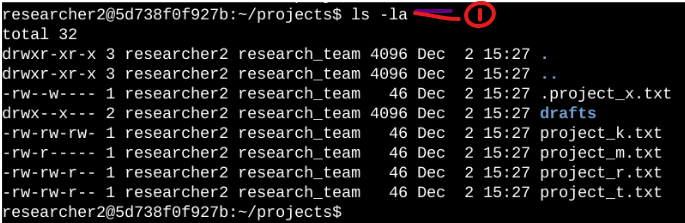

The output of my command indicates that there is one directory named `drafts`, one hidden file named `.project_x.txt`, and five other project files.

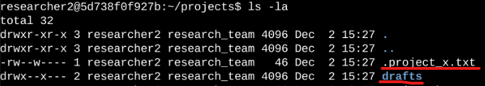

The 10-character string in the first column represents the permissions set on each file or directory.

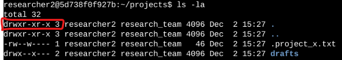

## Describe the permissions string
The 10-character string can be deconstructed to determine who is authorized to access the file and their specific permissions. The characters and what they represent are as follows:
- 1st character: This character is either a `d` or hyphen `(-)` and indicates the file type. If it’s a `d`, it’s a directory. If it’s a hyphen `(-)`, it’s a regular file.
  
- 2nd-4th characters: These characters indicate the read `(r),` write `(w)`, and execute `(x)` permissions for the user. When one of these characters is a hyphen `(-)` instead, it indicates that this permission is not granted to the user.
  
- 5th-7th characters: These characters indicate the read `(r)`, write `(w)`, and execute `(x)` permissions for the group. When one of these characters is a hyphen `(-)` instead, it indicates that this permission is not granted for the group.
  
- 8th-10th characters: These characters indicate the read `(r)`, write `(w)`, and execute `(x)` permissions for others. This owner type consists of all other users on the system apart from the user and the group. When one of these characters is a hyphen `(-)` instead, that indicates that this permission is not granted for others.

For example, the file permissions for `project_t.txt` are `-rw-rw-r–`. Since the first character is a hyphen `(-)`, this indicates that `project_t.txt` is a file, not a directory. The second, fifth, and eighth characters are all r, which indicates that user, group, and other all have read permissions. The third and sixth characters are `w`, which indicates that only the user and group have write permissions. No one has execute permissions for `project_t.txt`.

## Change file permissions
The organization determined that others shouldn't have write access to any of their files. To comply with this, I referred to the file permissions that I previously returned. I determined `project_k.txt` must have the write access removed for others. The following code demonstrates how I used Linux commands to do this:

The first two lines of the following screenshot display the commands I entered, and the other lines display the output of the second command.

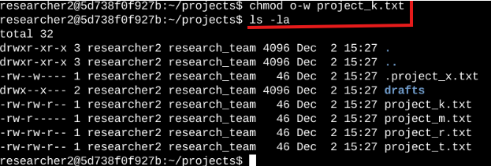

The `chmod` command changes the permissions on files and directories. The first argument indicates what permissions should be changed, and the second argument specifies the file or directory. In this example, I removed write permissions from others for the `project_k.txt` file. After this, I used `ls -la` to review the updates I made.

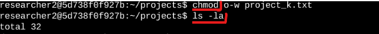

## Change file permissions on a hidden file
The research team at my organization recently archived `project_x.txt`. They do not want anyone to have write access to this project, but the user and group should have read access. 
The following code demonstrates how I used Linux commands to change the permissions:

The first two lines of the following screenshot display the commands I entered, and the other lines display the output of the second command.

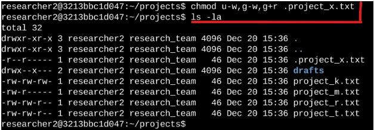

I know .project_x.txt is a hidden file because it starts with a period `(.)`. In this example, I removed write permissions from the user and group, and added read permissions to the group. I removed write permissions from the user with `u-w`. Then, I removed write permissions from the group with `g-w`, and added read permissions to the group with `g+r`. 

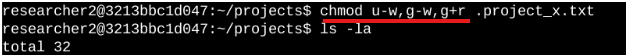

## Change directory permissions
My organization only wants the `researcher2` user to have access to the `drafts` directory and its contents. This means that no one other than `researcher2` should have execute permissions. The following code demonstrates how I used Linux commands to change the permissions:

The output here displays the permission listing for several files and directories. Line 1 indicates the current directory (projects). line 2 indicates the parent directory (home). 

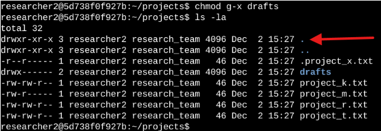

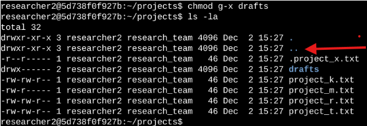

Line 3 indicates a regular file titled `.project_x.txt`. Line 4 is the directory (drafts) with restricted permissions. 

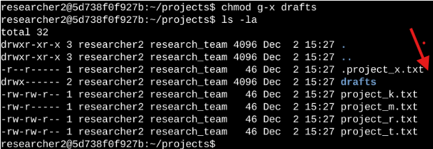

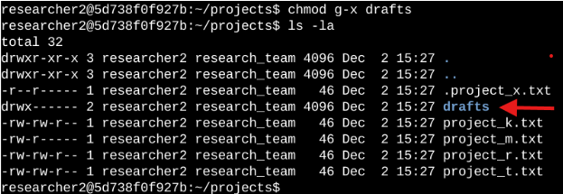

Here you can see that only researcher2 has execute permissions.  It was previously determined that the group had execute permissions, so I used the `chmod` command to remove them. The `researcher2`user already had execute permissions, so they did not need to be added.

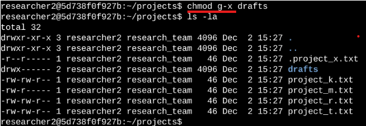

## Summary
I changed multiple permissions to match the level of authorization my organization wanted for files and directories in the `projects` directory. The first step in this was using `ls -la` to check the permissions for the directory. This informed my decisions in the following steps. I then used the `chmod` command multiple times to change the permissions on files and directories.

